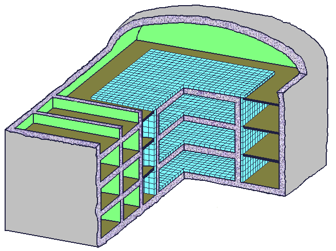
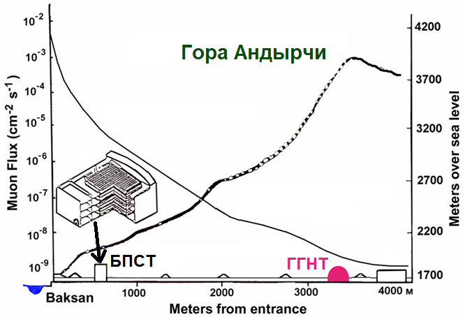
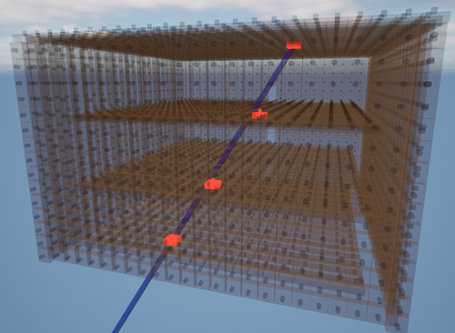
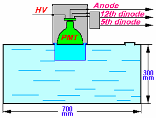
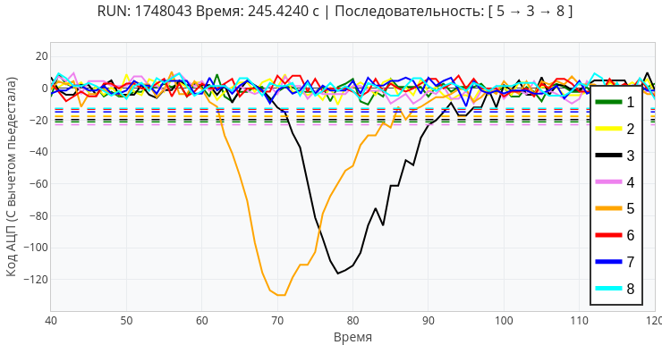
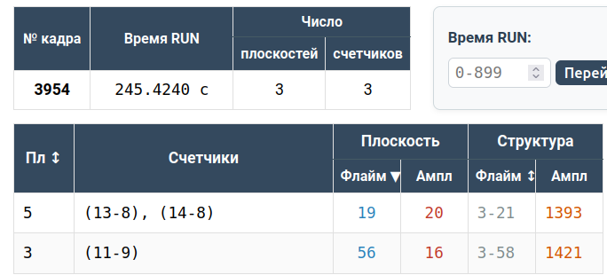
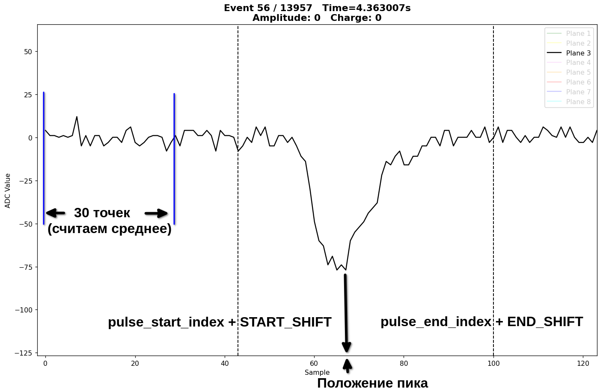

# Обработка данных БПСТ

Проект служит алгоритмической базой для обучения сотрудников, создания доступных инструментов и автоматизации обработки данных.

## Описание установки

<table>
  <tr>
    <th>Схема БПСТ</th>
    <th>Схема выработки в горе Андырчи</th>
  </tr>
  <tr>
    <td></td>
    <td></td>
  </tr>
  <tr>
    <th>Схема события из нижней полусферы</th>
    <th>Схема счетчика БПСТ</th>
  </tr>
  <tr>
    <td></td>
    <td></td>
  </tr>
</table>

## Два способа записи данных

<table>
  <tr>
    <th>АЦП (запись осциллограмм)</th>
    <th>Система регистрации БПСТ</th>
  </tr>
  <tr>
    <td></td>
    <td></td>
  </tr>
</table>

## Основные задачи и перспективы:
* **Обработка импульсов:** Выделение импульсов, расчет амплитуды и заряда *(текущая задача)*.
* **Синхронизация:** Сопоставление "кадров" из данных БПСТ с соответствующими импульсами и их параметрами.
* **Аналитические инструменты:**
  * Мониторинг текущего состояния установки.
  * Построение различных спектров - амплитудный, зарядовый, и др.
  * Обнаружение редких физических процессов.

## Описание алгоритма работы с импульсами



### 🔍 Поиск импульса

#### Шаг 1. Расчет пьедестала
  Пьедестал - "нулевой уровень" осциллограммы, он всегда отличается от нуля.
  Считаем среднее значение первых 30 точек осциллограммы - в данном диапазоне нет импульса. Получаем `pedestal_mean`.
  Считаем стандартное отклонение первых 30 точек осциллограммы. Получаем `noise_sigma`.

#### Шаг 2. Определение порогов
Определяем порог для начала импульса как:
```python
start_threshold = pedestal_mean - (4 * noise_sigma)
```

Определяем порог для конца импульса как:
```python
stop_threshold = pedestal_mean - (1 * noise_sigma)
```

#### Шаг 3. Нахождение импульса
  Ставим более строгое условие: нужно чтобы три точки осциллограммы подряд пересекали эти пороги.
  Если условия для обоих порогов выполнены - импульс найден. Имеем точки:
  * `pulse_start_index` - место пересечения (превышения) начального порога;
  * `pulse_end_index` - место пересечения (опускания ниже) конечного порога.

#### Шаг 4. Определение положения пика
  Если импульс найден можем найти положение его пикового значения `pulse_peak_index`.

### 🧹 Подготовка импульса

#### Шаг 1. Сдвиг осциллограммы в "ноль"
  Добавляем вертикальный сдвиг всей осциллограмме. Вычитаем из каждой точки `pedestal_mean`.
  В этом случае пьедестал осциллограммы будет равен нулю.

  *Этот шаг опциональный. Для ускорения обработки мы не выполняем этот сдвиг.
  Далее будем вычитать пьедестал в процессе обработки конкретных импульсов.*

#### Шаг 2. Расширение интервала, внутри которого должен находиться импульс
  Нам нужно определить интервал, внутри которого содержится импульс полностью, чтобы не отрезать фронт и спад импульса.
  Для этого расширяем границы.

  Левая граница:
```python
pulse_start_index + START_SHIFT
```

  Если эта точка начитает вторгаться в наши первые 30 точек то присваиваем ей значение 30.

  Правая граница:
```python
pulse_end_index + END_SHIFT
```

  Таким образом мы расширили область c импульсом так что импульс должен полностью уместиться внутри.

  *В нашем текущем коде определение этих точек осуществляется для осциллограмм с импульсами в теле функции `calc_AQ(oscillograms, pulses_start, pulses_end)` внутри цикла:*
```python
for i in range(len(oscillograms)):
```

### ⚡ Определение амплитуды (в Вольтах) и заряда (в Кулонах)

#### 📐 Шкалы осей и физические параметры

Предыдущие этапы можно выполнить и без этого шага, но лучше всего в самом начале перевести данные АЦП в физические величины - вольты и наносекунды.

Для этого нужно знать следующие характеристики нашего прибора:
1. **Временная шкала (ось X):** перевод шагов в наносекунды.
    * Частота дискретизации АЦП: `200 MS/s`.

2. **Амплитудная шкала (ось Y):** перевод кодов в Вольты.
    * Разрешение АЦП: `12 бит`.
    * Входной диапазон напряжения: *уточняется*.

3. **Параметры тракта:** для расчёта заряда также необходимо знать входное сопротивление.
    * Входное сопротивление: `50 Ом`.


#### 📈 Амплитуда
Расчет шага по напряжению (цены деления АЦП) осуществляется по формуле:

$$\Large V_{\text{шаг}} = \frac{V_{\text{range}}}{2^N}$$

где:

$V_{range}$ — входной диапазон напряжения прибора в Вольтах,

$N$ — разрядность АЦП в битах.

Амплитуда импульса ($A$) — это чистая высота пика над уровнем шума в Вольтах. Она рассчитывается по формуле:

$$\Large A = V_{\text{peak}} - V_{\text{pedestal}}$$

где:

$V_{\text{peak}}$ — напряжение в точке `pulse_peak_index`.

$V_{\text{pedestal}}$ — среднее значение пьедестала (`pedestal_mean`, в Вольтах).


#### ⏱️ Время
Расчет временного шага осуществляется по формуле:

$$\Large T_{\text{шаг}} = \frac{1 \text{ с}}{f_s}$$

где $f_s$ — частота дискретизации.


#### 🔋 Заряд

Заряд импульса ($Q$) — это интеграл тока по времени:

$$\Large Q = \int I(t) dt$$

Чтобы перевести измеренное напряжение ($V$) в ток, используется закон Ома:

$$\Large I = V/R$$

где $R$ — входное сопротивление прибора (50 Ом).

В коде мы работаем с дискретными точками, поэтому интеграл превращается в сумму.
Расчёт заряда выполняется строго внутри границ импульса (от `pulse_start_index + START_SHIFT` до `pulse_end_index + END_SHIFT`) по формуле:

$$\Large Q = \sum_{i=\text{start}}^{\text{end}} I_i \cdot T_{\text{шаг}} = \frac{T_{\text{шаг}}}{R} \sum_{i=\text{start}}^{\text{end}} (V_i - V_{\text{pedestal}})$$

где:

$T_{шаг}$ — временной шаг дискретизации (который мы посчитали выше).

$R$ — сопротивление (*50 Ом*).

$V_i$ — значение напряжения в i-й точке.

$V_{pedestal}$ — среднее значение пьедестала (`pedestal_mean`, в Вольтах), которое нужно вычесть, чтобы интегрировать только чистый полезный сигнал.


## Текущая задача

  Для удобства программа разделена на несколько файлов.
  На данный момент мы должны считать коэффициенты для перевода кодов АЦП (ось Y) в Вольты, шагов по времени (ось X) в секунды. Делаем это внутри функции:
```python
def axes_to_V_s(): # Файл processing.py
```

  После того как мы получим эти коэффициенты мы должны применять их в дальнейших расчетах.
  Далее мы должны считать заряды найденных импульсов внутри функции:
```python
def calc_AQ(oscillograms, pulses_start, pulses_end): # Файл processing.py
```

  Данные в графике у нас будут представлены в мВ (амплитуда), нс (время), пКл (заряд).